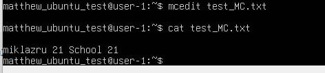
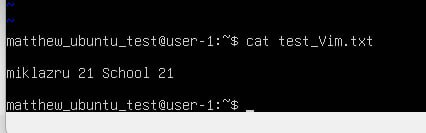

## Часть 1 Установка и настройка
-Проверка версии линукс

*Скриншот 1, 2: Показаны версия линукса  и настройки

## Часть 2: Создание пользователя
- Создание нового пользователя (Дополняя личные данные)
- Проверка естть ли новый пользователь

## Часть 3: Настройка сети ОС
- Задать название машины user-1
- Установка временных зон (Москва, Россия)
- Получение ip адреса от DHCP сервера
- Проверка пинга удаленного хотса ya.ru и 1.1.1.1

Интерфейс lo - это loopback-интерфейс, который используется для тестирования и отладки сетевых приложений на локальном компьютере. Он всегда имеет IP-адрес 127.0.0.1.

DHCP (Dynamic Host Configuration Protocol) - это сетевой протокол, который автоматически назначает IP-адреса и другие сетевые параметры (например, шлюз и DNS-серверы) устройствам в сети.

## Часть 4: Обновление ОС
- Обновление системы (скачивание установочных файлов)
- Обновление системы (установление файлов)

## Часть 5: Использование команды sudo
- Задать полномочия sudo для нового аккаунта
- Поменять hostname для нового аккаунта
- Проверить предоставленно ли

Команда sudo (SuperUser DO) предоставляет привилегированный доступ к выполнению команд от имени суперпользователя или других пользователей, обладающих правами sudo. Это позволяет выполнить определенные операции, требующие повышенных привилегий, без необходимости полного входа в систему под суперпользователем.

## Часть 6: Установка  и настройка службы времени
- Скачать библиотеку время/дата
- Поверка времени и даты

## Часть 7: Установка и использования текстовых редакторов
- Скачать текстовые редакторы
- Создать файлы, используя текстовые редакторы и вписывание (сохраняя)
- Редактировать файл, не сохраняя

## Часть 8: Установка и базовая настройка сервиса SSHD
- Обновление системы
- Установка библиотеки SSHD
- Настройка sshd
- Настройка sshd порт на 2022
- Перезапуск системы sshd
- Вывод

## Часть 9: Установка и использование утилит top, htop
- Установка утилит top, htop
- Отчет top
- uptime
- кол-во автор. пользователей
- общая загрузка системы
- загрузка cpu
- загрузка памяти
- pid процесса занимающего больше всего памяти
- pid процесса, занимающего больше всего процессорного времени
- Отчет htp
- PID
- PERCENT_CPU
- PERCENT_MEM
- TIME
- sshd процесс
- clock, uptime

Uptime: 16:24:09 up 6 min
Количество авторизованных пользователей: 1 user
Общая загрузка системы: load average: 0.44, 0.48, 0.28
Общее количество процессов: Tasks: 161 total
Загрузка CPU: %Cpu(s): 0.0 us, 0.0 sy, 0.0 ni, 99.7 id, 0.1 wa, 0.0 hi, 0.1 si, 0.0 st
Загрузка памяти: MiB Mem: 7940.7 total, 7005.5 free, 449.8 used, 726.8 buff/cache

## Часть 10: Использование утилиты fdisk
- Запуск команды fdisk -l

## Часть 11: Использование утилиты df
- Запуск команды df
- Запуск команды df -Th

Команда df:

Размер раздела: 14G
Размер занятого пространства: 4.4G
Размер свободного пространства: 8.6G
Процент использования: 34%
Единица измерения: Гигабайты (G)
Команда df -Th:

Размер раздела: 14G
Размер занятого пространства: 4.4G
Размер свободного пространства: 8.6G
Процент использования: 34%
Тип файловой системы: ext4

## Часть 12: Использование утилиты du
- Запуск команды du
- Вывод папок /home/
- Вывод папок /var/
- Вывод папок /var/log/

## Часть 13: Установка и использование утилиты ncdu
- Установить утилиту ncdu
- Просмотреть папки home, var, var/log

## Часть 14: Работа с системными журналами
- Прочитать информацию внутри файла dmesg
- Прочитать информацию внутри файла syslog
- Прочитать информацию внутри файла auth.log
- Заменить статус авторизации на успешно
- Проверить файд auth.log на наличие статуса
- Отрыть журнал sshd и найти последний перезапуск

## Часть 15: Использование планировщика заданий CRON
- Найти в журнале cron 
- Вывести на экран строчку, которая выводит "uptime"
- После добавления строки перезапуск и собстевенно вывод

